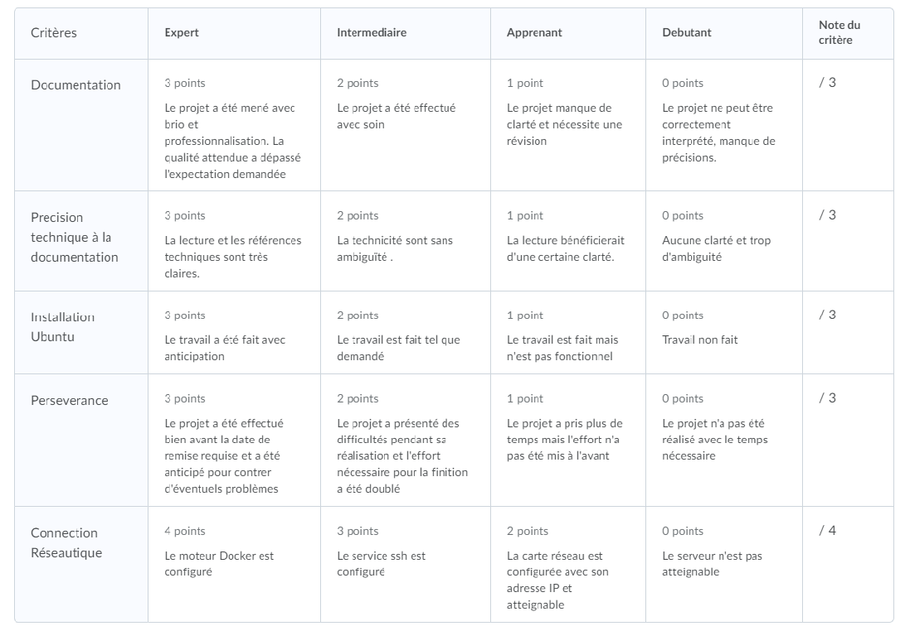

# Blog

Creer un blog (i.e. Wordpress) permettant de décrire l'installation de:

* Linux [Ubuntu 20.04LTS](https://releases.ubuntu.com/20.04/) plus précisément installer la version  Serveur en [64-bit](https://releases.ubuntu.com/20.04/ubuntu-20.04.1-live-server-amd64.iso)

## Creer un blog (i.e. wordpress.com)

Le `blog` permettra de décrire toute la recherche effectuée pour installer Linux sur les machines [HP Proliant G6 ou G7](https://github.com/CollegeBoreal/Laboratoires/tree/master/3202/proliant)

Astuces: 

* Utiliser un CD-Rom (si vous en avez un) ou une clé USB pour `booter` sur la machine

* Installer la machine dans le laboratoire:

       Choisir une adresse dans la plage de réseau:
       
       - Externe: 10.13.237.0/24
       
       
## Legende

| :hash:             | Commentaires                                  |
|--------------------|-----------------------------------------------|
| :zero:             | Aucune installation, ne peut pas être véfifié |
| :one:              | Blog Créé                                     |
| :two:              | Blog et Réseau Externe créé                   |
| :heavy_check_mark: | Prêt à être noté                              |

## Liste des blogs

|:hash:| :id:      |   Blog (https://wordpress.com)                                                    | [VPN](https://github.com/CollegeBoreal/Tutoriels/tree/main/V.VPN)  | [Check](README.md#legende) | [Reseau Externe](README.md#one-reseau-externe)| Baie |
|------|-----------|-----------------------------------------------------------------------------------|------|--------------------|---------------|----|
| 01   | 300106677 - [<image src="https://avatars.githubusercontent.com/u/71027895?v=4" width=20 height=20></image>](https://github.com/Leonaldo1994) | https://linux171117329530604526.wordpress.com/                                    | :heavy_check_mark:  | :heavy_check_mark:                | 10.13.237.37   | :three::seven: |
| 02   | 300115206 - [<image src="https://avatars.githubusercontent.com/u/73952068?v=4" width=20 height=20></image>](https://github.com/itonga) | https://jojo975297757.wordpress.com                                               | :x:  | :x:                | 10.13.237.?   |?|
| 03   | 300117811 - [<image src="https://avatars.githubusercontent.com/u/71027809?v=4" width=20 height=20></image>](https://github.com/sio-mh)  | https://ht69446081.wordpress.com                                                  | :x:  | :heavy_check_mark:                | 10.13.237.34   | :three::four: |            
| 04   | 300121460 - [<image src="https://avatars.githubusercontent.com/u/71027883?v=4" width=20 height=20></image>](https://github.com/daveinfo20) | https://linux974401364.wordpress.com                                              | :heavy_check_mark:  | :heavy_check_mark:                | 10.13.237.31   | :three::one: | 
| 05   | 300122014 - [<image src="https://avatars.githubusercontent.com/u/71392439?v=4" width=20 height=20></image>](https://github.com/sylvainEmm) | https://htttps614541743.wordpress.com                                             | :x:  | :x:                | 10.13.237.28   | :three::eight: |

#### Example
| :id:      |   Blog (https://wordpress.com)                          |
|-----------|---------------------------------------------------------|
| 300098957  <image src="https://avatars0.githubusercontent.com/u/62551735?s=400&v=4" width=20 height=20></image> | https://setrar.wordpress.com/2015/01/10/bitstamp/       | 

## References

### :one: Reseau Interne

http://jodies.de/ipcalc?host=10.13.237.0&mask1=24

       Address:   10.13.237.0           00001010.00001101.11101101.0 0000000
       Netmask:   255.255.255.256 = 24  11111111.11111111.11111111.0 0000000
       Wildcard:  0.0.0.127             00000000.00000000.00000000.1 1111111
       =>
       Network:   10.13.237.0/24        00001010.00001101.11101101.0 0000000 (Class A)
       Broadcast: 10.13.237.255         00001010.00001101.11101101.1 1111111
       HostMin:   10.13.237.1           00001010.00001101.11101101.0 0000001
       HostMax:   10.13.237.254         00001010.00001101.11101101.1 1111110
       Hosts/Net: 254                   (Private Internet)

# Grille de notation

 </img>
